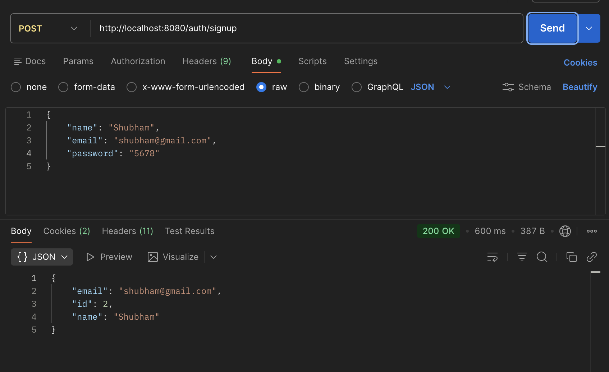
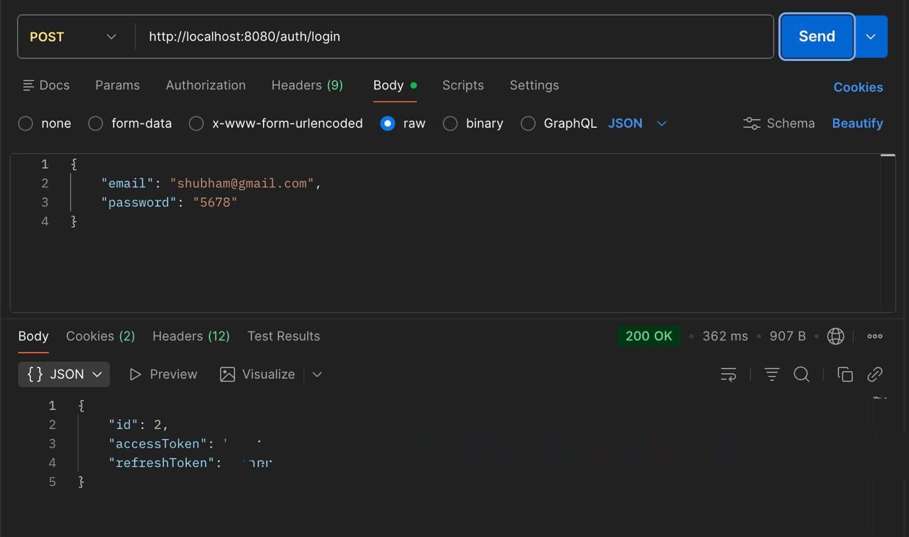
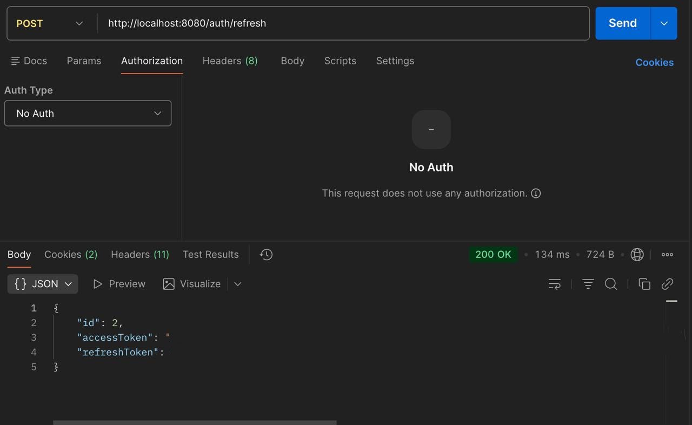
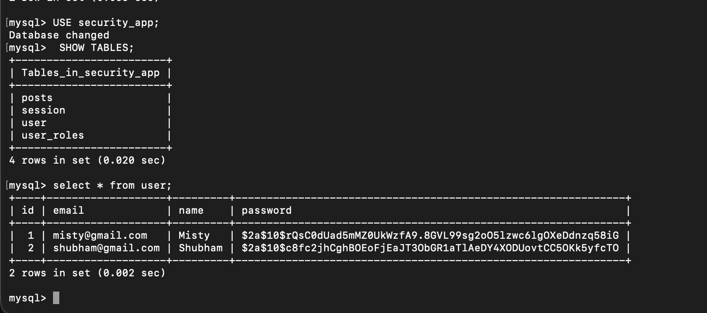

# 🔐 Spring Boot Security Demo

A backend-focused Spring Boot application built to understand and implement **authentication, authorization, JWT security, refresh tokens, role-based access control, OAuth2, and database integration** using Spring Security.

This project demonstrates how a real-world Spring Boot security system works from **user registration and login to accessing protected APIs**.

---

## 📌 Table of Contents

* [About the Project](#-about-the-project)
* [Features](#-features)
* [Technology Stack](#-technology-stack)
* [Project Architecture](#-project-architecture)
* [Authentication Flow](#-authentication-flow)
* [JWT Authentication](#-jwt-authentication)
* [Refresh Token](#-refresh-token)
* [Role-Based Authorization](#-role-based-authorization)
* [OAuth2 Authentication](#-oauth2-authentication)
* [Password Security](#-password-security)
* [Database](#-database)
* [API Endpoints](#-api-endpoints)
* [Screenshots](#-screenshots)
* [Project Structure](#-project-structure)
* [How to Run](#-how-to-run)
* [Security Considerations](#-security-considerations)
* [Future Improvements](#-future-improvements)

---

# 📖 About the Project

The **Spring Boot Security Demo** is a learning project designed to understand how authentication and authorization are implemented in a Spring Boot backend application.

The application provides APIs for:

* User registration
* User login
* JWT access-token generation
* Refresh-token based authentication
* Role-based authorization
* Protected APIs
* OAuth2 login
* MySQL database integration
* Password hashing
* Exception handling

The project follows a layered architecture where responsibilities are separated between **Controllers, Services, Repositories, Entities, DTOs, Filters, and Security Configuration**.

---

# ✨ Features

### 👤 User Management

* User registration
* User login
* User retrieval using email
* User roles such as `USER` and `ADMIN`

### 🔐 Authentication

* Spring Security authentication
* JWT-based authentication
* Access tokens
* Refresh tokens
* HTTP-only refresh-token cookies

### 🛡️ Authorization

* Role-based authorization
* Protected endpoints
* Public and authenticated routes
* `USER` / `ADMIN` access control

### 🔑 Password Security

* Password hashing using BCrypt
* Passwords are not stored as plain text

### 🌐 OAuth2

* OAuth2 client configuration
* Google OAuth2 login
* Custom OAuth2 success handler
* Automatic user creation after OAuth2 login
* JWT generation after successful OAuth2 authentication

### 🗄️ Database

* MySQL
* Spring Data JPA
* Hibernate ORM
* Automatic entity-to-table mapping

### ⚠️ Exception Handling

* Global exception handling
* Custom API error responses
* Resource-not-found handling

---

# 🛠️ Technology Stack

| Technology      | Purpose                        |
| --------------- | ------------------------------ |
| Java            | Programming Language           |
| Spring Boot     | Backend Framework              |
| Spring MVC      | REST API development           |
| Spring Security | Authentication & Authorization |
| Spring Data JPA | Database access                |
| Hibernate       | ORM                            |
| MySQL           | Relational Database            |
| JWT             | Token-based authentication     |
| OAuth2          | Social authentication          |
| Maven           | Dependency Management          |
| Lombok          | Boilerplate reduction          |
| ModelMapper     | DTO mapping                    |
| JUnit 5         | Testing                        |
| Tomcat          | Embedded Web Server            |

---

# 🏗️ Project Architecture

The application follows a layered architecture:

```text
                    Client / Postman
                           |
                           ↓
                    Controller Layer
                           |
                           ↓
                     Service Layer
                           |
                           ↓
                   Repository Layer
                           |
                           ↓
                      MySQL DB
```

For authentication:

```text
Client
  |
  ↓
Spring Security
  |
  ↓
JWT Authentication Filter
  |
  ↓
Validate JWT
  |
  ↓
SecurityContext
  |
  ↓
Protected Controller
```

---

# 🔐 Authentication Flow

The main authentication flow of the application is:

```text
                User
                 |
                 ↓
              Signup
                 |
                 ↓
          Password Hashing
                 |
                 ↓
             MySQL DB
                 |
                 ↓
               Login
                 |
                 ↓
        Authentication Manager
                 |
                 ↓
          Generate JWT Tokens
             /          \
            /            \
           ↓              ↓
    Access Token      Refresh Token
                         |
                         ↓
                    HTTP-only Cookie
```

---

# 🎫 JWT Authentication

JWT (**JSON Web Token**) is used to authenticate users without maintaining a traditional server-side login session.

After successful login:

```text
Email + Password
       ↓
Authentication
       ↓
JWT Access Token
       ↓
Client
```

For accessing a protected API, the client sends:

```text
Authorization: Bearer <access-token>
```

The request then goes through the JWT authentication filter.

```text
Client Request
      ↓
Authorization Header
      ↓
JWT Authentication Filter
      ↓
Extract Token
      ↓
Validate Token
      ↓
Extract User Information
      ↓
SecurityContext
      ↓
Protected Endpoint
```

The JWT contains information such as:

* User ID
* Email
* Roles
* Issued time
* Expiration time

---

# 🔄 Refresh Token

Access tokens are short-lived for security reasons.

When an access token expires, the refresh token can be used to obtain a new access token.

```text
Access Token
     |
     ↓
  Expires
     |
     ↓
Refresh Token
     |
     ↓
POST /auth/refresh
     |
     ↓
New Access Token
```

The refresh token is stored inside an **HTTP-only cookie**.

This helps prevent JavaScript from directly accessing the refresh token.

---

# 👥 Role-Based Authorization

The application supports role-based authorization.

Example roles:

```text
USER
ADMIN
```

Roles are converted into Spring Security authorities:

```text
USER  → ROLE_USER
ADMIN → ROLE_ADMIN
```

This allows different users to access different resources.

Example:

```text
USER
 └── User APIs

ADMIN
 ├── User APIs
 └── Admin APIs
```

If a normal user tries to access an admin-only endpoint, Spring Security can return:

```text
403 Forbidden
```

---

# 🌐 OAuth2 Authentication

The project also contains OAuth2 login support.

The OAuth2 flow is:

```text
User
 |
 ↓
Google Login
 |
 ↓
Google Authentication
 |
 ↓
OAuth2SuccessHandler
 |
 ↓
Find User by Email
 |
 ↓
Create User if Required
 |
 ↓
Generate Access Token
 |
 ↓
Generate Refresh Token
 |
 ↓
Redirect to Application
```

The project uses a custom:

```text
OAuth2SuccessHandler
```

to handle the actions after successful OAuth2 authentication.

> Google OAuth2 credentials should be configured using your own credentials and should never be committed to GitHub.

---

# 🔑 Password Security

User passwords should never be stored as plain text.

For example:

```text
❌ 123456
```

Instead, the password is hashed using BCrypt:

```text
✅ $2a$10$................................
```

The application verifies the password during login using the password encoder.

---

# 🗄️ Database

The application uses **MySQL** as the relational database.

Spring Data JPA and Hibernate are used to communicate with the database.

The main entities include:

```text
User
PostEntity
Session
```

The general flow is:

```text
Controller
    ↓
Service
    ↓
Repository
    ↓
Hibernate / JPA
    ↓
MySQL
```

---

# 📡 API Endpoints

## Authentication APIs

| Method | Endpoint        | Description                           |
| ------ | --------------- | ------------------------------------- |
| `POST` | `/auth/signup`  | Register a new user                   |
| `POST` | `/auth/login`   | Authenticate user and generate tokens |
| `POST` | `/auth/refresh` | Generate a new access token           |

### Signup

```http
POST /auth/signup
```

Example request:

```json
{
    "name": "Misty",
    "email": "misty@gmail.com",
    "password": "your-password"
}
```

### Login

```http
POST /auth/login
```

Example request:

```json
{
    "email": "misty@gmail.com",
    "password": "your-password"
}
```

### Refresh Token

```http
POST /auth/refresh
```

The refresh token is read from the HTTP-only cookie.

---

# 📸 Screenshots

> The screenshots below demonstrate the working APIs and security features of the application.

## 1. User Signup

The user can create a new account using the signup API.



---

## 2. Successful Login

After successful authentication, the application generates the required tokens.



---


## 3. Refresh Token

The refresh-token endpoint can be used to obtain a new access token.



---

## 4. MySQL Database

User information is persisted in the MySQL database.



---

# 📂 Project Structure

```text
Spring-Boot-Security-demo
│
├── src
│   ├── main
│   │   ├── java
│   │   │   └── com.SpringSecurity.Spring_Boot_Security_demo
│   │   │       │
│   │   │       ├── Controllers
│   │   │       ├── advice
│   │   │       ├── config
│   │   │       ├── dto
│   │   │       ├── entities
│   │   │       ├── exceptions
│   │   │       ├── filters
│   │   │       ├── handlers
│   │   │       ├── repositories
│   │   │       └── services
│   │   │
│   │   └── resources
│   │       ├── application.properties
│   │       ├── application.yml
│   │       └── static
│   │
│   └── test
│
├── pom.xml
└── README.md
```

---

# ⚙️ How to Run

## 1. Clone the Repository

```bash
git clone https://github.com/misty2810/springbootlearn.git
```

## 2. Open the Project

Open:

```text
Spring-Boot-Security-demo
```

in IntelliJ IDEA.

## 3. Configure MySQL

Create the database:

```sql
CREATE DATABASE security_app;
```

Update your database configuration:

```properties
spring.datasource.url=jdbc:mysql://localhost:3306/security_app
spring.datasource.username=root
spring.datasource.password=YOUR_PASSWORD
```

## 4. Configure JWT

Set your JWT secret:

```properties
jwt.secretKey=YOUR_JWT_SECRET
```

## 5. Run the Application

Run:

```text
SpringBootSecurityDemoApplication
```

The application will start on:

```text
http://localhost:8080
```

---

# 🔒 Security Considerations

**Never commit sensitive credentials to GitHub.**

The following values should remain private:

```text
Database passwords
JWT secret keys
OAuth2 client secrets
API keys
Access tokens
Refresh tokens
```

For example:

```properties
spring.datasource.password=${DB_PASSWORD}
jwt.secretKey=${JWT_SECRET}
```

Environment variables can then be used to provide the actual values locally.

---

# 🧪 Testing

The project also contains Spring Boot tests using JUnit.

The JWT functionality is tested by:

* Generating an access token
* Validating/extracting information from the token
* Loading the Spring application context

Run the tests using IntelliJ IDEA or Maven:

```bash
./mvnw test
```

---

# 🚀 Future Improvements

Some possible improvements for this project are:

* Add email verification
* Add forgot/reset password functionality
* Add logout with refresh-token invalidation
* Store refresh tokens securely in the database
* Add token rotation
* Add more comprehensive unit and integration tests
* Add API documentation using Swagger/OpenAPI
* Add Docker support
* Add CI/CD using GitHub Actions
* Complete Google OAuth2 production configuration
* Add frontend integration
* Deploy the application to a cloud platform

---

# 🎯 What I Learned

Through this project, I gained hands-on experience with:

* Spring Boot
* Spring MVC
* REST API development
* Spring Security
* Authentication and Authorization
* JWT authentication
* Access and Refresh Tokens
* Role-Based Access Control
* BCrypt password hashing
* OAuth2 authentication
* HTTP cookies
* Spring Data JPA
* Hibernate
* MySQL
* DTO-based architecture
* Exception handling
* JUnit testing
* Maven

---

# 👩‍💻 Author

**Misty Jangid**

B.Tech CSIT Student
Interested in **Backend Development, Spring Boot, AI/ML and Secure Applications**

---

⭐ If you find this project useful, feel free to explore the code and learn from it!
